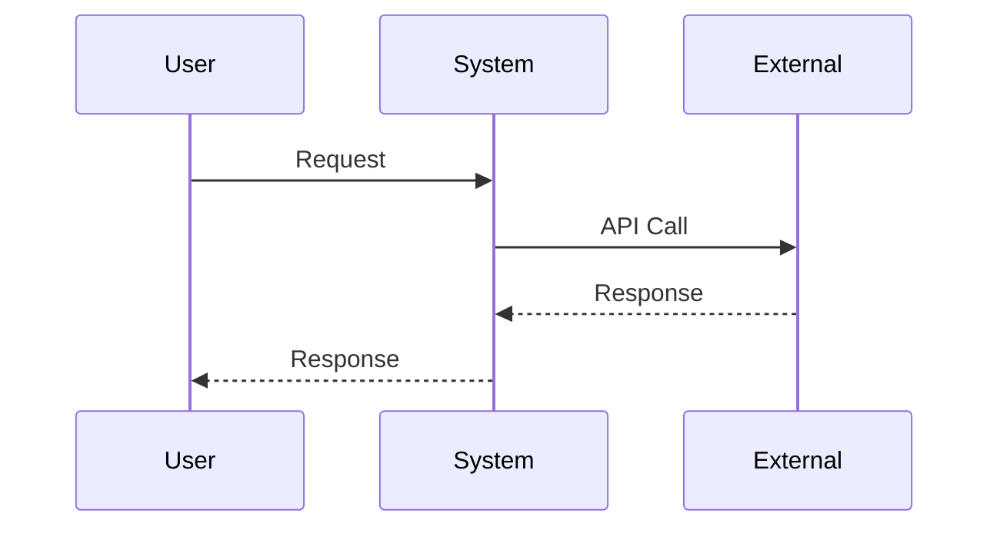

# Architecture Diagrams

This directory contains system context, container, component, and infrastructure diagrams aligned with the documented architectural decisions.

## Purpose

Architecture diagrams serve multiple purposes:

- **Communication** – Visual representation of system architecture for stakeholders
- **Documentation** – Living documentation of system design
- **Decision support** – Visualize architectural decisions and their impact
- **Onboarding** – Help new team members understand system structure
- **Analysis** – Identify dependencies, bottlenecks, and improvement opportunities

All diagrams in this directory should align with the [Architecture Vision](../docs/architecture-vision.md) and be referenced in [Solution Architecture](../docs/solution-architecture-template.md) documents.

## Diagram Types

### C4 Model Diagrams

We use the [C4 Model](https://c4model.com/) for visualizing software architecture. The C4 model provides four levels of abstraction:

#### 1. System Context Diagram (Level 1)

**Purpose:** Shows the system as a box in the center, surrounded by its users and the other systems that it interacts with.

**What to include:**
- The system being built or modified
- Users (actors, personas, roles)
- External systems (third-party services, legacy systems, databases)
- Relationships and interactions

**Naming convention:** `{system-name}-context.{format}`

**Example:** `payment-system-context.png`

#### 2. Container Diagram (Level 2)

**Purpose:** Zooms into the system boundary, showing the high-level technical building blocks (containers).

**What to include:**
- Containers (web applications, mobile apps, databases, file systems, message queues, etc.)
- Technology choices for each container
- Interactions between containers
- External systems and users

**Naming convention:** `{system-name}-containers.{format}`

**Example:** `payment-system-containers.png`

#### 3. Component Diagram (Level 3)

**Purpose:** Zooms into an individual container to show the components inside it.

**What to include:**
- Components (logical groupings of code)
- Responsibilities of each component
- Technology/framework used
- Interactions between components
- External dependencies

**Naming convention:** `{system-name}-{container-name}-components.{format}`

**Example:** `payment-system-api-components.png`

#### 4. Code Diagram (Level 4)

**Purpose:** Optional level showing classes, interfaces, and their relationships.

**When to use:** Only for complex or critical components where code-level detail is needed.

**Naming convention:** `{system-name}-{container-name}-{component-name}-code.{format}`

### Sequence Diagrams

**Purpose:** Show how components interact over time, particularly useful for understanding request flows and business processes.

**What to include:**
- Actors (users, external systems)
- Components/services involved
- Message flow and order
- Timing information (if relevant)
- Error handling and alternative flows

**Naming convention:** `{system-name}-{use-case}-sequence.{format}`

**Example:** `payment-system-process-payment-sequence.png`

### Infrastructure Diagrams

**Purpose:** Show the infrastructure, deployment, and operational aspects of the system.

**What to include:**
- Cloud providers and regions
- Network topology
- Load balancers, gateways, proxies
- Databases and data stores
- Message queues and event streams
- Monitoring and logging infrastructure
- Security boundaries (VPCs, security groups)

**Naming convention:** `{system-name}-infrastructure.{format}`

**Example:** `payment-system-infrastructure.png`

### Deployment Diagrams

**Purpose:** Show how the system is deployed across environments and infrastructure.

**What to include:**
- Deployment environments (dev, staging, production)
- Container orchestration (Kubernetes, Docker Swarm)
- Replication and scaling
- Environment-specific configurations

**Naming convention:** `{system-name}-deployment.{format}`

**Example:** `payment-system-deployment.png`

### Data Flow Diagrams

**Purpose:** Show how data flows through the system.

**What to include:**
- Data sources
- Data transformations
- Data stores
- Data consumers
- Data flow direction

**Naming convention:** `{system-name}-data-flow.{format}`

**Example:** `payment-system-data-flow.png`

## Diagram Formats

### Recommended Formats

1. **PlantUML** (`.puml`) – Text-based, version-controlled, easy to maintain
2. **Mermaid** (`.mmd` or `.md`) – Text-based, works well in Markdown
3. **Draw.io / diagrams.net** (`.drawio`) – Visual editor, XML-based, version-controllable
4. **PNG/SVG** (`.png`, `.svg`) – Rendered images (include source files)

### Format Guidelines

- **Source files preferred** – Keep source files (`.puml`, `.drawio`, `.mmd`) for easy editing
- **Rendered images** – Include rendered images (`.png`, `.svg`) for documentation
- **Version control** – All diagram source files should be in version control
- **Consistency** – Use consistent tools and styles across diagrams

## Tools and Resources

### Diagramming Tools

#### PlantUML
- **Website:** https://plantuml.com/
- **Pros:** Text-based, version-controllable, supports C4 model
- **Cons:** Requires learning syntax
- **C4 Plugin:** https://github.com/plantuml-stdlib/C4-PlantUML

#### Mermaid
- **Website:** https://mermaid.js.org/
- **Pros:** Text-based, works in Markdown, easy to learn
- **Cons:** Limited C4 support
- **Use for:** Sequence diagrams, flowcharts, simple architecture diagrams

#### Draw.io / diagrams.net
- **Website:** https://app.diagrams.net/
- **Pros:** Visual editor, easy to use, supports C4 model
- **Cons:** Binary format (though XML-based)
- **C4 Template:** Available in templates

#### Structurizr
- **Website:** https://structurizr.com/
- **Pros:** Purpose-built for C4 model, supports multiple views
- **Cons:** Commercial tool (free tier available)
- **Use for:** Complex systems with many diagrams

### C4 Model Resources

- **Official C4 Model Site:** https://c4model.com/
- **C4 Model Book:** "Software Architecture: The Hard Parts" by Neal Ford et al.
- **C4 Model Examples:** https://c4model.com/#Examples

## Diagram Conventions

### Naming Conventions

- Use kebab-case for file names: `payment-system-context.png`
- Include system name in file name
- Include diagram type in file name
- Use descriptive names that indicate purpose

### Color Coding

- **Users/Actors** – Blue or green
- **System being built** – Yellow or orange (highlight)
- **External systems** – Gray or light blue
- **Databases** – Cylinder shape, blue or gray
- **Containers** – Rounded rectangles
- **Components** – Rectangles

### Symbols and Shapes

- **Users** – Stick figures or person icons
- **Systems** – Boxes with system name
- **Databases** – Cylinders or database icons
- **Message queues** – Queue symbols or cloud shapes
- **APIs** – Rounded rectangles with "API" label
- **Mobile apps** – Mobile device shapes

### Labels and Annotations

- Use clear, descriptive labels
- Include technology names where relevant
- Add notes for non-obvious decisions
- Reference ADRs for significant decisions
- Include version or date for evolving diagrams

## Directory Structure

```
diagrams/
  ├── README.md (this file)
  ├── c4/
  │   ├── system-context/
  │   │   └── {system-name}-context.{format}
  │   ├── containers/
  │   │   └── {system-name}-containers.{format}
  │   └── components/
  │       └── {system-name}-{container}-components.{format}
  ├── sequences/
  │   └── {system-name}-{use-case}-sequence.{format}
  ├── infrastructure/
  │   └── {system-name}-infrastructure.{format}
  ├── deployment/
  │   └── {system-name}-deployment.{format}
  └── data-flow/
      └── {system-name}-data-flow.{format}
```

## Creating Diagrams

### Step 1: Choose the Right Level

- Start with **System Context** to understand the big picture
- Create **Container** diagrams for each system
- Add **Component** diagrams for complex containers
- Use **Sequence** diagrams for important flows

### Step 2: Identify Stakeholders

- Who are the users?
- What external systems are involved?
- What are the key interactions?

### Step 3: Document Technology Choices

- Include technology names in diagrams
- Reference ADRs for technology decisions
- Show deployment platforms (cloud, on-premises)

### Step 4: Show Relationships

- Use arrows to show data flow
- Label relationships clearly
- Show synchronous vs. asynchronous communication
- Indicate protocols (HTTP, gRPC, messaging)

### Step 5: Keep It Simple

- Focus on important relationships
- Don't show every detail
- Use multiple diagrams for different views
- Keep diagrams at appropriate abstraction level

## Maintaining Diagrams

### When to Update

- **Architecture changes** – When system architecture changes
- **New systems** – When new systems are added
- **Technology changes** – When technology choices change
- **Major refactoring** – When system structure changes significantly
- **Regular reviews** – Quarterly architecture reviews

### Update Process

1. **Identify change** – Document what changed and why
2. **Update diagram** – Modify diagram to reflect changes
3. **Review** – Have architecture team review updated diagram
4. **Update documentation** – Update related architecture documents
5. **Version** – Consider versioning for significant changes

### Version Control

- **Commit messages** – Include reason for diagram changes
- **Pull requests** – Review diagram changes like code changes
- **Version tags** – Tag major diagram versions
- **History** – Keep history of significant architectural changes

## Best Practices

### Do's

✅ **Keep diagrams simple** – Focus on important relationships, not every detail  
✅ **Use consistent notation** – Follow C4 model conventions  
✅ **Keep diagrams up to date** – Update when architecture changes  
✅ **Reference ADRs** – Link diagrams to relevant ADRs  
✅ **Include in documentation** – Reference diagrams in architecture documents  
✅ **Use source files** – Keep editable source files, not just images  
✅ **Review regularly** – Include diagrams in architecture reviews  
✅ **Version appropriately** – Version diagrams for major changes  

### Don'ts

❌ **Don't show implementation details** – Keep at appropriate abstraction level  
❌ **Don't duplicate information** – One diagram, one purpose  
❌ **Don't let diagrams get stale** – Update or remove outdated diagrams  
❌ **Don't over-complicate** – Simple diagrams are more valuable  
❌ **Don't skip levels** – Follow C4 model levels appropriately  
❌ **Don't ignore conventions** – Follow naming and style conventions  

## Integration with Documentation

### Solution Architecture Documents

Diagrams should be referenced in [Solution Architecture](../docs/solution-architecture-template.md) documents:

```markdown
## High-Level Architecture

See the system context diagram: [payment-system-context.png](./diagrams/c4/system-context/payment-system-context.png)

See the container diagram: [payment-system-containers.png](./diagrams/c4/containers/payment-system-containers.png)
```

### Architecture Decision Records

Reference diagrams in ADRs when they illustrate a decision:

```markdown
## Architecture

The following diagram shows the proposed architecture:


```

### README Files

Include key diagrams in project README files for quick reference.

## Examples

### Example: System Context Diagram

```
[User] --> [Payment System]
[Payment System] --> [Payment Gateway]
[Payment System] --> [User Database]
[Payment System] --> [Notification Service]
```

### Example: Container Diagram

```
[Web Application] --> [API Gateway]
[API Gateway] --> [Payment Service]
[API Gateway] --> [User Service]
[Payment Service] --> [Payment Database]
[User Service] --> [User Database]
```

## Templates

### PlantUML C4 Template

```plantuml
@startuml
!include https://raw.githubusercontent.com/plantuml-stdlib/C4-PlantUML/master/C4_Context.puml

LAYOUT_TOP_DOWN()

Person(user, "User", "Uses the system")
System(system, "System Name", "Description")
System_Ext(external, "External System", "Description")

Rel(user, system, "Uses")
Rel(system, external, "Integrates with")

@enduml
```

### Mermaid Sequence Diagram Template



## Related Documents

- **[Architecture Vision](../docs/architecture-vision.md)** – Overall architectural principles
- **[Solution Architecture Template](../docs/solution-architecture-template.md)** – Template for documenting solution architecture
- **[Architecture Decision Records](../adr/)** – Architectural decisions that diagrams illustrate

## Resources

- [C4 Model Official Site](https://c4model.com/)
- [PlantUML C4 Plugin](https://github.com/plantuml-stdlib/C4-PlantUML)
- [Mermaid Documentation](https://mermaid.js.org/)
- [Draw.io / diagrams.net](https://app.diagrams.net/)
- [Structurizr](https://structurizr.com/)

---

**Last Updated:** 2026-01-15  
**Maintained by:** Icarus Nova IT Architecture Team  
**Review Frequency:** Quarterly
