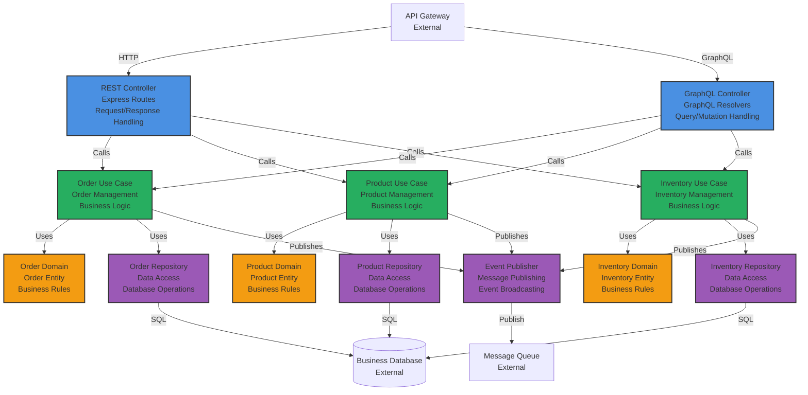

# C4 – Component Diagram

## Purpose

This diagram zooms into the **Business Service** container, showing the components (logical groupings of code) inside it. Components represent the internal structure of a container.

This diagram helps understand:
- What components make up the container
- Responsibilities of each component
- How components interact
- Dependencies between components

This diagram aligns with the [C4 Model](https://c4model.com/) Level 3. Similar component diagrams can be created for other containers as needed.

---

## Business Service Component Diagram

### Diagram

---

## Components

### Presentation Layer

#### REST Controller
- **Technology:** Express.js routes
- **Purpose:** Handle HTTP REST API requests
- **Responsibilities:**
  - Request validation
  - Request/response transformation
  - Error handling
  - HTTP status codes
- **Dependencies:** Use Cases

#### GraphQL Controller
- **Technology:** GraphQL resolvers (Apollo Server)
- **Purpose:** Handle GraphQL queries and mutations
- **Responsibilities:**
  - Query resolution
  - Mutation execution
  - Field resolvers
  - Error handling
- **Dependencies:** Use Cases

### Application Layer

#### Order Use Case
- **Purpose:** Order management business logic
- **Responsibilities:**
  - Create order
  - Update order
  - Cancel order
  - Get order details
  - Order validation
- **Dependencies:** Order Domain, Order Repository, Event Publisher

#### Product Use Case
- **Purpose:** Product management business logic
- **Responsibilities:**
  - Create product
  - Update product
  - Get product details
  - Product search
  - Product validation
- **Dependencies:** Product Domain, Product Repository, Event Publisher

#### Inventory Use Case
- **Purpose:** Inventory management business logic
- **Responsibilities:**
  - Check inventory
  - Update inventory
  - Reserve inventory
  - Release inventory
  - Inventory validation
- **Dependencies:** Inventory Domain, Inventory Repository, Event Publisher

### Domain Layer

#### Order Domain
- **Purpose:** Order domain model and business rules
- **Responsibilities:**
  - Order entity
  - Order business rules
  - Order state management
  - Order validation rules
- **Dependencies:** None (pure domain logic)

#### Product Domain
- **Purpose:** Product domain model and business rules
- **Responsibilities:**
  - Product entity
  - Product business rules
  - Product validation rules
  - Product pricing rules
- **Dependencies:** None (pure domain logic)

#### Inventory Domain
- **Purpose:** Inventory domain model and business rules
- **Responsibilities:**
  - Inventory entity
  - Inventory business rules
  - Stock validation
  - Reservation logic
- **Dependencies:** None (pure domain logic)

### Infrastructure Layer

#### Order Repository
- **Purpose:** Data access for orders
- **Responsibilities:**
  - Save order
  - Find order by ID
  - Find orders by criteria
  - Update order
  - Delete order
- **Dependencies:** Business Database

#### Product Repository
- **Purpose:** Data access for products
- **Responsibilities:**
  - Save product
  - Find product by ID
  - Find products by criteria
  - Update product
  - Delete product
- **Dependencies:** Business Database

#### Inventory Repository
- **Purpose:** Data access for inventory
- **Responsibilities:**
  - Get inventory levels
  - Update inventory
  - Reserve inventory
  - Release inventory
- **Dependencies:** Business Database

#### Event Publisher
- **Purpose:** Publish domain events
- **Responsibilities:**
  - Publish events to message queue
  - Event serialization
  - Event routing
- **Dependencies:** Message Queue

---

## Architecture Pattern

This component structure follows **Clean Architecture** principles:

1. **Dependency Rule:** Dependencies point inward
   - Presentation depends on Application
   - Application depends on Domain
   - Infrastructure depends on Application and Domain
   - Domain has no dependencies

2. **Separation of Concerns:**
   - **Presentation:** HTTP/GraphQL handling
   - **Application:** Use cases and orchestration
   - **Domain:** Business logic and rules
   - **Infrastructure:** Technical implementations

3. **Dependency Inversion:**
   - Use Cases depend on Repository interfaces (defined in Application layer)
   - Infrastructure implements Repository interfaces

**Reference:** See [ADR 0001](../adr/0001-why-clean-architecture.md) for Clean Architecture details.

---

## Component Interactions

### Request Flow

1. **API Gateway** → **REST/GraphQL Controller** (HTTP request)
2. **Controller** → **Use Case** (business operation)
3. **Use Case** → **Domain** (business rules validation)
4. **Use Case** → **Repository** (data access)
5. **Repository** → **Database** (SQL query)
6. **Use Case** → **Event Publisher** (publish domain event)
7. **Event Publisher** → **Message Queue** (async message)

### Event Flow

1. **Use Case** executes business logic
2. **Domain** raises domain events
3. **Use Case** publishes events via **Event Publisher**
4. **Event Publisher** sends to **Message Queue**
5. Other services consume events from queue

---

## Related Documents

- **[Container Diagram](./c4-containers.md)** – Higher level view
- **[Clean Architecture ADR](../adr/0001-why-clean-architecture.md)** – Architecture pattern
- **[Solution Architecture Template](../docs/solution-architecture-template.md)** – Architecture documentation

---

**Last Updated:** 2026-01-15  
**Maintained by:** Icarus Nova IT Architecture Team
