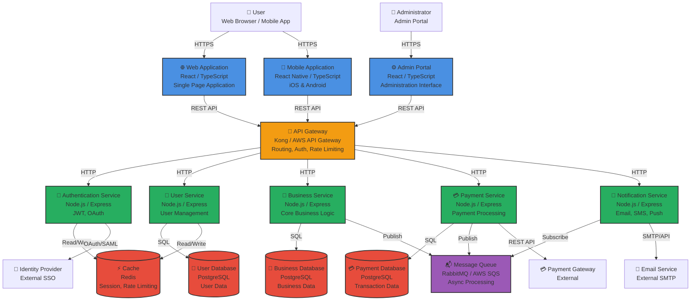

# C4 – Container Diagram

## Purpose

This diagram zooms into the **Icarus Platform** system boundary, showing the high-level technical building blocks (containers). Containers are deployable units that execute code or store data.

This diagram provides the technical architecture view and helps understand:
- What containers make up the system
- Technology choices for each container
- How containers interact
- External dependencies

This diagram aligns with the [C4 Model](https://c4model.com/) Level 2 and should be referenced in [Solution Architecture](../docs/solution-architecture-template.md) documents.

---

## Container Diagram

### Diagram

---

## Containers

### Web Application
- **Technology:** React, TypeScript, Material-UI
- **Purpose:** Primary user interface for business users
- **Deployment:** Static files served via CDN, containerized
- **Features:** Responsive design, offline support, PWA capabilities
- **Authentication:** JWT tokens, SSO integration

### Admin Portal
- **Technology:** React, TypeScript, Admin UI components
- **Purpose:** Administrative interface for system management
- **Deployment:** Static files served via CDN, containerized
- **Features:** User management, system configuration, monitoring dashboards
- **Authentication:** JWT tokens with admin role, MFA required

### Mobile Application
- **Technology:** React Native, TypeScript
- **Purpose:** Mobile access for iOS and Android
- **Deployment:** App stores (Apple App Store, Google Play)
- **Features:** Native device integration, push notifications, offline mode
- **Authentication:** Biometric authentication, JWT tokens

### API Gateway
- **Technology:** Kong / AWS API Gateway
- **Purpose:** Single entry point for all API requests
- **Features:**
  - Request routing
  - Authentication and authorization
  - Rate limiting
  - Request/response transformation
  - API versioning
  - Request logging
- **Deployment:** Containerized, load balanced

### Authentication Service
- **Technology:** Node.js, Express, Passport.js
- **Purpose:** Authentication and authorization
- **Features:**
  - JWT token generation and validation
  - OAuth 2.0 integration
  - SAML integration
  - Session management
  - Password management
- **Data:** User credentials, tokens (in cache)
- **Deployment:** Containerized, horizontally scalable

### User Service
- **Technology:** Node.js, Express
- **Purpose:** User management and profile operations
- **Features:**
  - User CRUD operations
  - Profile management
  - User preferences
  - User search and filtering
- **Data:** User profiles, preferences (in User Database)
- **Deployment:** Containerized, horizontally scalable

### Business Service
- **Technology:** Node.js, Express
- **Purpose:** Core business logic and operations
- **Features:**
  - Business process orchestration
  - Business rule enforcement
  - Data validation
  - Business event publishing
- **Data:** Business entities (in Business Database)
- **Deployment:** Containerized, horizontally scalable

### Payment Service
- **Technology:** Node.js, Express
- **Purpose:** Payment processing and transaction management
- **Features:**
  - Payment processing
  - Transaction management
  - Refund processing
  - Payment gateway integration
  - Payment event publishing
- **Data:** Transactions, payment records (in Payment Database)
- **Deployment:** Containerized, horizontally scalable
- **Security:** PCI-DSS compliance considerations

### Notification Service
- **Technology:** Node.js, Express
- **Purpose:** Notification delivery (email, SMS, push)
- **Features:**
  - Email notifications
  - SMS notifications
  - Push notifications
  - Notification templates
  - Delivery tracking
- **Data:** Notification queue (from Message Queue)
- **Deployment:** Containerized, horizontally scalable

### User Database
- **Technology:** PostgreSQL
- **Purpose:** User data storage
- **Data:** User profiles, authentication data, preferences
- **Features:** ACID transactions, backups, replication
- **Deployment:** Managed database service or containerized

### Business Database
- **Technology:** PostgreSQL
- **Purpose:** Business data storage
- **Data:** Business entities, transactions, business rules
- **Features:** ACID transactions, backups, replication
- **Deployment:** Managed database service or containerized

### Payment Database
- **Technology:** PostgreSQL
- **Purpose:** Payment and transaction data storage
- **Data:** Payment transactions, refunds, payment methods
- **Features:** ACID transactions, backups, replication, encryption
- **Deployment:** Managed database service or containerized
- **Security:** Encrypted at rest, PCI-DSS compliance

### Cache
- **Technology:** Redis
- **Purpose:** Caching and session storage
- **Data:**
  - User sessions
  - Rate limiting counters
  - Frequently accessed data
  - Temporary data
- **Features:** In-memory storage, TTL support, pub/sub
- **Deployment:** Containerized or managed service

### Message Queue
- **Technology:** RabbitMQ / AWS SQS
- **Purpose:** Asynchronous message processing
- **Features:**
  - Message queuing
  - Pub/sub messaging
  - Message persistence
  - Dead letter queues
- **Use Cases:**
  - Payment processing events
  - Notification delivery
  - Business event processing
- **Deployment:** Containerized or managed service

---

## Technology Decisions

### Frontend
- **React/TypeScript:** Modern, type-safe, large ecosystem
- **Material-UI:** Consistent design system
- **React Native:** Cross-platform mobile development

### Backend
- **Node.js/Express:** JavaScript ecosystem, fast development
- **Containerized:** Docker for consistent deployments

### Databases
- **PostgreSQL:** Relational database, ACID compliance, JSON support
- **Redis:** High-performance caching and session storage

### Infrastructure
- **API Gateway:** Centralized API management
- **Message Queue:** Asynchronous processing

**Reference:** See [ADR 0001](../adr/0001-why-clean-architecture.md) for architecture decisions.

---

## Communication Patterns

### Synchronous
- **HTTP/REST:** Primary communication pattern
- **API Gateway → Services:** HTTP requests
- **Services → Databases:** SQL queries

### Asynchronous
- **Message Queue:** Event-driven processing
- **Pub/Sub:** Event publishing and subscription

### External
- **OAuth 2.0:** Authentication with Identity Provider
- **REST API:** Payment Gateway integration
- **SMTP/API:** Email service integration

---

## Security Considerations

### API Gateway
- Authentication and authorization
- Rate limiting
- Request validation
- SSL/TLS termination

### Services
- Service-to-service authentication
- Input validation
- Output sanitization
- Error handling (no sensitive data leakage)

### Databases
- Encrypted connections
- Encrypted at rest (sensitive data)
- Access control
- Backup encryption

---

## Related Documents

- **[System Context Diagram](./c4-system-context.md)** – Higher level view
- **[Component Diagrams](./c4-components.md)** – Next level of detail
- **[Architecture Decision Records](../adr/)** – Technology decisions

---

**Last Updated:** 2026-01-15  
**Maintained by:** Icarus Nova IT Architecture Team
