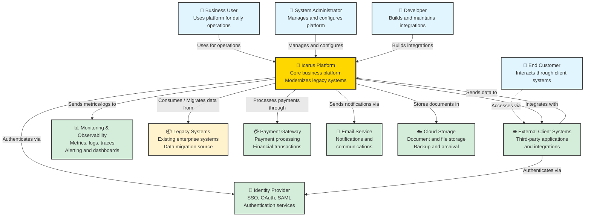

# C4 – System Context Diagram

## Purpose

This diagram describes the **Icarus Platform** in its business context, showing users, actors, and external systems that interact with it. The system context diagram provides the highest level of abstraction and helps stakeholders understand:

- Who uses the system
- What external systems the system integrates with
- The system's role in the broader ecosystem
- Key relationships and data flows

This diagram aligns with the [C4 Model](https://c4model.com/) Level 1 and should be referenced in [Solution Architecture](../docs/solution-architecture-template.md) documents.

---

## System Context

### Diagram



### Alternative: PlantUML Version

```plantuml
@startuml
!include https://raw.githubusercontent.com/plantuml-stdlib/C4-PlantUML/master/C4_Context.puml

LAYOUT_TOP_DOWN()

Person(businessUser, "Business User", "Uses platform for daily operations")
Person(systemAdmin, "System Administrator", "Manages and configures platform")
Person(developer, "Developer", "Builds and maintains integrations")
Person(endCustomer, "End Customer", "Interacts through client systems")

System(icarusPlatform, "Icarus Platform", "Core business platform that modernizes legacy systems")

System_Ext(clientSystems, "External Client Systems", "Third-party applications and integrations")
System_Ext(identityProvider, "Identity Provider", "SSO, OAuth, SAML authentication services")
System_Ext(monitoring, "Monitoring & Observability", "Metrics, logs, traces, alerting and dashboards")
System_Ext(legacySystems, "Legacy Systems", "Existing enterprise systems, data migration source")
System_Ext(paymentGateway, "Payment Gateway", "Payment processing and financial transactions")
System_Ext(emailService, "Email Service", "Notifications and communications")
System_Ext(cloudStorage, "Cloud Storage", "Document and file storage, backup and archival")

Rel(businessUser, icarusPlatform, "Uses for operations")
Rel(systemAdmin, icarusPlatform, "Manages and configures")
Rel(developer, icarusPlatform, "Builds integrations")
Rel(endCustomer, clientSystems, "Accesses via")

Rel(icarusPlatform, clientSystems, "Integrates with")
Rel(icarusPlatform, identityProvider, "Authenticates via")
Rel(icarusPlatform, monitoring, "Sends metrics/logs to")
Rel(icarusPlatform, legacySystems, "Consumes / Migrates data from")
Rel(icarusPlatform, paymentGateway, "Processes payments through")
Rel(icarusPlatform, emailService, "Sends notifications via")
Rel(icarusPlatform, cloudStorage, "Stores documents in")

Rel(clientSystems, identityProvider, "Authenticates via")
Rel(clientSystems, icarusPlatform, "Sends data to")

@enduml
```

---

## Actors and Users

### Business User
- **Role:** Primary end user of the platform
- **Interactions:** Uses the platform for daily business operations
- **Access:** Web application, mobile app (if applicable)
- **Authentication:** Via Identity Provider (SSO)

### System Administrator
- **Role:** Manages and configures the platform
- **Interactions:** System configuration, user management, monitoring
- **Access:** Admin portal, configuration interfaces
- **Authentication:** Via Identity Provider with admin privileges

### Developer
- **Role:** Builds and maintains integrations
- **Interactions:** API access, integration development, testing
- **Access:** API documentation, development environment, sandbox
- **Authentication:** Via Identity Provider with developer privileges

### End Customer
- **Role:** Final consumer of services (indirect user)
- **Interactions:** Accesses services through client systems
- **Access:** Via External Client Systems
- **Authentication:** Handled by client systems

---

## External Systems

### External Client Systems
- **Purpose:** Third-party applications and integrations
- **Interaction:** Bidirectional data exchange
- **Protocols:** REST APIs, webhooks, message queues
- **Data:** Business data, transactions, user information
- **Security:** API authentication, rate limiting

### Identity Provider
- **Purpose:** Centralized authentication and authorization
- **Interaction:** Authentication requests, user profile data
- **Protocols:** OAuth 2.0, SAML 2.0, OpenID Connect
- **Features:** Single Sign-On (SSO), multi-factor authentication
- **Security:** Token-based authentication, session management

### Monitoring & Observability
- **Purpose:** System health, performance monitoring, and observability
- **Interaction:** Receives metrics, logs, and traces
- **Data:** Application metrics, infrastructure metrics, logs, distributed traces
- **Features:** Dashboards, alerting, log aggregation, performance analysis
- **Compliance:** Audit logs, security event monitoring

### Legacy Systems
- **Purpose:** Existing enterprise systems being modernized
- **Interaction:** Data migration, integration during transition
- **Data:** Historical data, reference data, business rules
- **Protocols:** Various (REST, SOAP, file transfers, database connections)
- **Status:** Being phased out, data migrated to Icarus Platform

### Payment Gateway
- **Purpose:** Payment processing and financial transactions
- **Interaction:** Payment processing, transaction management
- **Protocols:** REST APIs, webhooks for notifications
- **Data:** Payment requests, transaction results, refunds
- **Security:** PCI-DSS compliance, encrypted communications

### Email Service
- **Purpose:** Email notifications and communications
- **Interaction:** Sends transactional and notification emails
- **Protocols:** SMTP, REST API
- **Data:** Email content, recipient information, templates
- **Features:** Email templates, delivery tracking, bounce handling

### Cloud Storage
- **Purpose:** Document and file storage, backup and archival
- **Interaction:** Stores and retrieves documents and files
- **Protocols:** REST APIs (S3-compatible)
- **Data:** Documents, images, backups, archives
- **Features:** Versioning, lifecycle policies, encryption

---

## Key Relationships

### User → Platform
- **Business Users** use the platform for daily operations
- **System Administrators** manage and configure the platform
- **Developers** build integrations and access APIs
- All users authenticate via **Identity Provider**

### Platform → External Systems
- **Client Systems:** Bidirectional integration for data exchange
- **Identity Provider:** Authentication and authorization
- **Monitoring:** One-way data flow (platform → monitoring)
- **Legacy Systems:** Data consumption and migration
- **Payment Gateway:** Payment processing
- **Email Service:** Notification delivery
- **Cloud Storage:** Document storage and archival

### Data Flow Patterns
- **Synchronous:** API calls for real-time operations
- **Asynchronous:** Message queues for event-driven operations
- **Batch:** Scheduled data migrations and synchronizations

---

## Technology Stack (High-Level)

### Platform
- **Architecture:** Modular monolith (evolving to microservices as needed)
- **Cloud:** Multi-cloud capable (cloud-agnostic design)
- **Deployment:** Containerized (Docker, Kubernetes)

### Integration Patterns
- **REST APIs:** Primary integration pattern
- **Message Queues:** Asynchronous processing
- **Webhooks:** Event notifications
- **File Transfers:** Batch data processing

---

## Security Considerations

### Authentication
- All users authenticate via Identity Provider
- SSO for seamless user experience
- Multi-factor authentication (MFA) for sensitive operations

### Authorization
- Role-based access control (RBAC)
- API authentication via OAuth 2.0 tokens
- Service-to-service authentication

### Data Protection
- Encryption in transit (TLS)
- Encryption at rest for sensitive data
- Data classification and handling policies

### Compliance
- Regulatory compliance (GDPR, HIPAA, PCI-DSS as applicable)
- Audit logging for compliance
- Data residency requirements

---

## Evolution and Migration

### Legacy System Migration
- **Strategy:** Incremental migration from legacy systems
- **Approach:** Strangler Fig pattern
- **Timeline:** Phased migration over time
- **Data:** Historical data migration, reference data synchronization

### Future Considerations
- Additional external system integrations
- New user roles and access patterns
- Enhanced monitoring and observability
- Expanded cloud storage capabilities

---

## Related Documents

- **[Architecture Vision](../docs/architecture-vision.md)** – Overall architectural principles
- **[Solution Architecture Template](../docs/solution-architecture-template.md)** – Detailed architecture documentation
- **[Container Diagram](./c4-containers.md)** – Next level of detail (containers)
- **[Architecture Decision Records](../adr/)** – Decisions affecting this system

---

## Version History

| Version | Date | Author | Changes |
|---------|------|--------|---------|
| 1.0 | 2026-01-15 | Architecture Team | Initial system context diagram |

---

**Last Updated:** 2026-01-15  
**Maintained by:** Icarus Nova IT Architecture Team  
**Next Review:** 2026-04-15 (Quarterly)
