# Deployment Diagram

## Purpose

This diagram shows how the **Icarus Platform** is deployed across different environments, illustrating the deployment topology, container orchestration, and environment-specific configurations.

This diagram helps understand:
- Deployment environments
- Container orchestration
- Replication and scaling
- Environment-specific configurations
- Deployment processes

---

## Deployment Overview

### Diagram

```mermaid
graph TB
    subgraph Environments["🌍 Deployment Environments"]
        subgraph Production["🔴 Production Environment"]
            subgraph ProdK8s["Kubernetes Cluster - Production"]
                subgraph ProdNamespace["Namespace: production"]
                    ProdWebApp[Web App<br/>Replicas: 3<br/>Auto-scaling: 2-10]
                    ProdAdminPortal[Admin Portal<br/>Replicas: 2<br/>Auto-scaling: 1-5]
                    ProdAPIGateway[API Gateway<br/>Replicas: 3<br/>Auto-scaling: 2-8]
                    ProdAuthService[Auth Service<br/>Replicas: 3<br/>Auto-scaling: 2-6]
                    ProdUserService[User Service<br/>Replicas: 3<br/>Auto-scaling: 2-6]
                    ProdBusinessService[Business Service<br/>Replicas: 5<br/>Auto-scaling: 3-10]
                    ProdPaymentService[Payment Service<br/>Replicas: 3<br/>Auto-scaling: 2-6]
                    ProdNotificationService[Notification Service<br/>Replicas: 2<br/>Auto-scaling: 1-4]
                end
            end

            subgraph ProdDB["Database - Production"]
                ProdDBPrimary[(PostgreSQL Primary<br/>Multi-AZ)]
                ProdDBReplica1[(Read Replica 1<br/>AZ-1)]
                ProdDBReplica2[(Read Replica 2<br/>AZ-2)]
            end

            subgraph ProdCache["Cache - Production"]
                ProdCachePrimary[(Redis Primary<br/>Multi-AZ)]
                ProdCacheReplica[(Redis Replica)]
            end
        end

        subgraph Staging["🟡 Staging Environment"]
            subgraph StagingK8s["Kubernetes Cluster - Staging"]
                subgraph StagingNamespace["Namespace: staging"]
                    StagingWebApp[Web App<br/>Replicas: 1]
                    StagingAPIGateway[API Gateway<br/>Replicas: 1]
                    StagingServices[Services<br/>Replicas: 1 each]
                end
            end

            StagingDB[(PostgreSQL<br/>Single Instance)]
            StagingCache[(Redis<br/>Single Instance)]
        end

        subgraph Development["🟢 Development Environment"]
            subgraph DevK8s["Kubernetes Cluster - Development"]
                subgraph DevNamespace["Namespace: development"]
                    DevWebApp[Web App<br/>Replicas: 1]
                    DevServices[Services<br/>Replicas: 1 each]
                end
            end

            DevDB[(PostgreSQL<br/>Single Instance)]
            DevCache[(Redis<br/>Single Instance)]
        end
    end

    subgraph CICD["🔄 CI/CD Pipeline"]
        GitRepo[Git Repository<br/>Source Code]
        BuildStage[Build Stage<br/>Docker Build]
        TestStage[Test Stage<br/>Unit & Integration Tests]
        SecurityScan[Security Scan<br/>Vulnerability Scanning]
        DeployStage[Deploy Stage<br/>Kubernetes Deploy]
    end

    subgraph ContainerRegistry["📦 Container Registry"]
        ProdImages[Production Images<br/>Tagged: v1.0.0, latest]
        StagingImages[Staging Images<br/>Tagged: staging]
        DevImages[Development Images<br/>Tagged: dev]
    end

    %% CI/CD Flow
    GitRepo -->|Push| BuildStage
    BuildStage -->|Build| TestStage
    TestStage -->|Test| SecurityScan
    SecurityScan -->|Scan| DeployStage
    DeployStage -->|Deploy| ProdK8s
    DeployStage -->|Deploy| StagingK8s
    DeployStage -->|Deploy| DevK8s

    %% Container Registry
    BuildStage -->|Push| ContainerRegistry
    ContainerRegistry -->|Pull| ProdK8s
    ContainerRegistry -->|Pull| StagingK8s
    ContainerRegistry -->|Pull| DevK8s

    %% Production connections
    ProdServices -->|Read/Write| ProdDBPrimary
    ProdServices -->|Read| ProdDBReplica1
    ProdServices -->|Read| ProdDBReplica2
    ProdServices -->|Read/Write| ProdCachePrimary
    ProdServices -->|Read| ProdCacheReplica

    %% Staging connections
    StagingServices -->|Read/Write| StagingDB
    StagingServices -->|Read/Write| StagingCache

    %% Development connections
    DevServices -->|Read/Write| DevDB
    DevServices -->|Read/Write| DevCache

    style Production fill:#ffebee,stroke:#333,stroke-width:3px
    style Staging fill:#fff3e0,stroke:#333,stroke-width:2px
    style Development fill:#e8f5e9,stroke:#333,stroke-width:2px
    style CICD fill:#e3f2fd,stroke:#333,stroke-width:2px
    style ContainerRegistry fill:#f3e5f5,stroke:#333,stroke-width:2px
```

---

## Deployment Environments

### Production Environment

#### Purpose
- **Live system** serving real users
- **High availability** requirements
- **Performance** critical
- **Security** and compliance requirements

#### Configuration
- **Kubernetes Cluster:** Multi-AZ deployment
- **Replicas:** Multiple replicas for all services
- **Auto-scaling:** Enabled for all services
- **Database:** Primary + read replicas (multi-AZ)
- **Cache:** Primary + replica (high availability)
- **Monitoring:** Full monitoring and alerting
- **Backup:** Automated daily backups
- **SSL/TLS:** Production certificates

#### Scaling Configuration
- **Web App:** 2-10 replicas (CPU: 70%, Memory: 80%)
- **API Gateway:** 2-8 replicas (CPU: 70%, Memory: 80%)
- **Services:** 2-6 replicas each (CPU: 70%, Memory: 80%)
- **Business Service:** 3-10 replicas (higher load)

### Staging Environment

#### Purpose
- **Pre-production testing** before production deployment
- **Integration testing** with external systems
- **Performance testing** and load testing
- **User acceptance testing** (UAT)

#### Configuration
- **Kubernetes Cluster:** Single-AZ deployment
- **Replicas:** Single replica for most services
- **Auto-scaling:** Disabled (fixed replicas)
- **Database:** Single instance
- **Cache:** Single instance
- **Monitoring:** Basic monitoring
- **Backup:** Weekly backups
- **SSL/TLS:** Staging certificates

### Development Environment

#### Purpose
- **Development** and feature testing
- **Local development** support
- **Rapid iteration** and testing
- **Integration** with development tools

#### Configuration
- **Kubernetes Cluster:** Single-AZ deployment (or local)
- **Replicas:** Single replica
- **Auto-scaling:** Disabled
- **Database:** Single instance (can be shared)
- **Cache:** Single instance (can be shared)
- **Monitoring:** Minimal monitoring
- **Backup:** No automated backups
- **SSL/TLS:** Self-signed certificates (or none)

---

## Container Orchestration

### Kubernetes Deployment

#### Deployment Strategy
- **Rolling Updates:** Default deployment strategy
- **Blue-Green:** For critical services (optional)
- **Canary:** For gradual rollouts (optional)

#### Resource Management
- **Resource Requests:** Minimum resources guaranteed
- **Resource Limits:** Maximum resources allowed
- **CPU:** Requests and limits defined per service
- **Memory:** Requests and limits defined per service

#### Health Checks
- **Liveness Probe:** Restart container if unhealthy
- **Readiness Probe:** Remove from load balancer if not ready
- **Startup Probe:** Wait for slow-starting containers

#### Service Discovery
- **Kubernetes Services:** Internal service discovery
- **DNS:** Service names resolve to service IPs
- **Load Balancing:** Built-in load balancing

---

## CI/CD Pipeline

### Pipeline Stages

#### 1. Source Control
- **Git Repository:** Source code management
- **Branch Strategy:** GitFlow or GitHub Flow
- **Pull Requests:** Code review required
- **Branch Protection:** Protected main/master branch

#### 2. Build Stage
- **Docker Build:** Build container images
- **Multi-stage Builds:** Optimize image size
- **Build Caching:** Cache layers for faster builds
- **Image Tagging:** Tag with version and commit SHA

#### 3. Test Stage
- **Unit Tests:** Run unit tests
- **Integration Tests:** Run integration tests
- **Code Coverage:** Measure and enforce coverage
- **Test Reports:** Generate test reports

#### 4. Security Scan
- **Vulnerability Scanning:** Scan container images
- **Dependency Scanning:** Scan dependencies
- **Secret Scanning:** Scan for hardcoded secrets
- **Policy Enforcement:** Block deployment on critical issues

#### 5. Deploy Stage
- **Environment Promotion:** Deploy to dev → staging → production
- **Kubernetes Deploy:** Apply Kubernetes manifests
- **Rollout Verification:** Verify deployment success
- **Rollback:** Automatic rollback on failure

### Deployment Strategies

#### Rolling Update (Default)
- **Gradual Replacement:** Replace pods gradually
- **Zero Downtime:** No downtime during update
- **Rollback:** Easy rollback if issues detected

#### Blue-Green Deployment
- **Two Environments:** Blue (current) and Green (new)
- **Switch Traffic:** Switch traffic after verification
- **Instant Rollback:** Switch back to blue if issues

#### Canary Deployment
- **Gradual Rollout:** Deploy to small percentage first
- **Monitor:** Monitor metrics and errors
- **Expand:** Gradually increase traffic if successful

---

## Container Registry

### Image Management
- **Registry:** Container registry (Docker Hub, ECR, ACR, GCR)
- **Image Tagging:**
  - `latest` – Latest build
  - `v1.0.0` – Version tags
  - `staging` – Staging environment
  - `dev` – Development environment
  - `{commit-sha}` – Commit-based tags

### Image Security
- **Vulnerability Scanning:** Scan all images
- **Image Signing:** Sign images for verification
- **Access Control:** Control who can push/pull images
- **Retention Policy:** Retain images for defined period

---

## Configuration Management

### Environment Variables
- **Secrets:** Stored in secrets manager
- **Config Maps:** Kubernetes ConfigMaps for non-sensitive config
- **Environment-Specific:** Different configs per environment

### Feature Flags
- **Feature Toggles:** Enable/disable features per environment
- **Gradual Rollout:** Enable features gradually
- **A/B Testing:** Test features with subset of users

---

## Monitoring and Observability

### Production
- **Full Monitoring:** All metrics, logs, traces
- **Alerting:** Comprehensive alerting rules
- **Dashboards:** Real-time dashboards
- **SLA Monitoring:** Monitor SLA compliance

### Staging
- **Basic Monitoring:** Key metrics and logs
- **Alerting:** Critical alerts only
- **Dashboards:** Basic dashboards

### Development
- **Minimal Monitoring:** Error logs only
- **No Alerting:** No production alerts
- **Local Logs:** Logs available locally

---

## Disaster Recovery

### Backup Strategy
- **Database Backups:** Daily automated backups
- **Configuration Backups:** Version-controlled configs
- **Image Backups:** Images in container registry
- **Backup Retention:** 30 days for production

### Recovery Procedures
- **RTO:** Recovery Time Objective: 4 hours
- **RPO:** Recovery Point Objective: 1 hour
- **Documentation:** Documented recovery procedures
- **Testing:** Quarterly disaster recovery testing

---

## Related Documents

- **[Infrastructure Diagram](./infrastructure-diagram.md)** – Infrastructure details
- **[Container Diagram](./c4-containers.md)** – Application containers
- **[Architecture Decision Records](../adr/)** – Deployment decisions

---

**Last Updated:** 2026-01-15  
**Maintained by:** Icarus Nova IT Architecture Team
