# Infrastructure Diagram

## Purpose

This diagram shows the infrastructure, deployment, and operational aspects of the **Icarus Platform**, including cloud resources, network topology, and operational services.

This diagram helps understand:
- Cloud provider and regions
- Network architecture
- Infrastructure components
- Security boundaries
- Monitoring and logging infrastructure

---

## Infrastructure Overview

### Diagram

```mermaid
graph TB
    subgraph Internet["🌐 Internet"]
        Users[Users]
        Admins[Administrators]
    end

    subgraph CDN["📡 CDN / Edge"]
        StaticAssets[Static Assets<br/>Web App, Admin Portal]
    end

    subgraph CloudProvider["☁️ Cloud Provider (Multi-Cloud)"]
        subgraph VPC["🔒 VPC - Production"]
            subgraph PublicSubnet["Public Subnet"]
                LoadBalancer[Load Balancer<br/>Application Load Balancer]
                APIGateway[API Gateway<br/>Kong / Managed Service]
                BastionHost[Bastion Host<br/>SSH Access]
            end

            subgraph PrivateSubnet["Private Subnet - Application"]
                subgraph AppCluster["Application Cluster"]
                    WebAppContainers[Web App Containers<br/>Kubernetes Pods]
                    ServiceContainers[Service Containers<br/>Kubernetes Pods]
                end
            end

            subgraph PrivateSubnetDB["Private Subnet - Database"]
                DBCluster[(Database Cluster<br/>PostgreSQL<br/>Primary + Replicas)]
                CacheCluster[(Cache Cluster<br/>Redis<br/>Primary + Replicas)]
            end

            subgraph PrivateSubnetQueue["Private Subnet - Messaging"]
                MessageQueueCluster[Message Queue<br/>RabbitMQ / Managed Service]
            end
        end

        subgraph VPCDev["🔒 VPC - Development"]
            DevCluster[Development Cluster<br/>Kubernetes]
            DevDB[(Development Database<br/>PostgreSQL)]
        end

        subgraph ObjectStorage["📦 Object Storage"]
            DocumentStorage[Document Storage<br/>S3 / Blob Storage]
            BackupStorage[Backup Storage<br/>S3 / Blob Storage]
        end

        subgraph Monitoring["📊 Monitoring & Observability"]
            LogAggregation[Log Aggregation<br/>ELK / CloudWatch Logs]
            MetricsCollection[Metrics Collection<br/>Prometheus / CloudWatch]
            Tracing[Tracing Backend<br/>Jaeger / X-Ray]
            Alerting[Alerting System<br/>PagerDuty / CloudWatch Alarms]
        end

        subgraph Security["🔐 Security Services"]
            SecretsManager[Secrets Manager<br/>Vault / AWS Secrets Manager]
            CertificateManager[Certificate Manager<br/>Let's Encrypt / ACM]
            WAF[Web Application Firewall<br/>Cloud WAF]
        end
    end

    subgraph ExternalServices["🌍 External Services"]
        IdentityProvider[Identity Provider<br/>SSO Service]
        PaymentGateway[Payment Gateway<br/>External API]
        EmailService[Email Service<br/>SMTP / API]
    end

    %% User connections
    Users -->|HTTPS| CDN
    Admins -->|HTTPS| CDN
    CDN -->|HTTPS| LoadBalancer

    %% Load balancer to services
    LoadBalancer -->|HTTPS| APIGateway
    LoadBalancer -->|HTTPS| WebAppContainers

    %% API Gateway to services
    APIGateway -->|HTTP| ServiceContainers

    %% Services to databases
    ServiceContainers -->|SQL| DBCluster
    ServiceContainers -->|Redis Protocol| CacheCluster
    ServiceContainers -->|AMQP| MessageQueueCluster

    %% Services to storage
    ServiceContainers -->|API| DocumentStorage
    ServiceContainers -->|Backup| BackupStorage

    %% Services to external
    ServiceContainers -->|OAuth/SAML| IdentityProvider
    ServiceContainers -->|REST API| PaymentGateway
    ServiceContainers -->|SMTP/API| EmailService

    %% Monitoring
    ServiceContainers -.->|Logs| LogAggregation
    ServiceContainers -.->|Metrics| MetricsCollection
    ServiceContainers -.->|Traces| Tracing
    MetricsCollection -->|Alerts| Alerting

    %% Security
    ServiceContainers -->|Retrieve Secrets| SecretsManager
    LoadBalancer -->|SSL/TLS| CertificateManager
    LoadBalancer -->|Traffic Filtering| WAF

    %% Admin access
    Admins -->|SSH| BastionHost
    BastionHost -->|SSH| AppCluster

    style VPC fill:#e8f5e9,stroke:#333,stroke-width:2px
    style VPCDev fill:#fff3e0,stroke:#333,stroke-width:2px
    style AppCluster fill:#e3f2fd,stroke:#333,stroke-width:2px
    style DBCluster fill:#fce4ec,stroke:#333,stroke-width:2px
    style Monitoring fill:#f3e5f5,stroke:#333,stroke-width:2px
    style Security fill:#fff9c4,stroke:#333,stroke-width:2px
```

---

## Infrastructure Components

### Network Architecture

#### Virtual Private Cloud (VPC)
- **Production VPC:** Isolated network for production workloads
- **Development VPC:** Separate network for development and testing
- **Network Segmentation:** Public and private subnets
- **Security Groups:** Network-level access control

#### Subnets
- **Public Subnet:** Internet-facing resources (load balancers, API gateways)
- **Private Subnet - Application:** Application containers (no direct internet access)
- **Private Subnet - Database:** Database clusters (no internet access)
- **Private Subnet - Messaging:** Message queue clusters

### Compute Infrastructure

#### Kubernetes Cluster
- **Container Orchestration:** Kubernetes for container management
- **Auto-scaling:** Horizontal Pod Autoscaling (HPA)
- **Service Mesh:** Optional service mesh for service-to-service communication
- **Deployment:** Rolling updates, blue-green deployments

#### Load Balancer
- **Application Load Balancer:** Routes traffic to application containers
- **SSL/TLS Termination:** Handles HTTPS connections
- **Health Checks:** Monitors container health
- **Auto-scaling:** Scales based on traffic

### Data Storage

#### Database Cluster
- **Primary Database:** PostgreSQL primary instance
- **Read Replicas:** Multiple read replicas for scaling
- **Backup:** Automated backups with point-in-time recovery
- **High Availability:** Multi-AZ deployment
- **Encryption:** Encrypted at rest and in transit

#### Cache Cluster
- **Redis Cluster:** Distributed cache
- **Primary + Replicas:** High availability setup
- **Persistence:** Optional persistence for critical data
- **Encryption:** Encrypted in transit

#### Object Storage
- **Document Storage:** S3-compatible storage for documents
- **Backup Storage:** Long-term backup storage
- **Lifecycle Policies:** Automatic archival and deletion
- **Versioning:** Object versioning enabled

### Messaging Infrastructure

#### Message Queue
- **RabbitMQ / Managed Service:** Message queue for async processing
- **High Availability:** Clustered setup
- **Persistence:** Message persistence enabled
- **Dead Letter Queues:** Error handling

### Security Infrastructure

#### Secrets Manager
- **Vault / AWS Secrets Manager:** Centralized secrets management
- **Encryption:** Secrets encrypted at rest
- **Rotation:** Automatic secret rotation
- **Access Control:** Role-based access

#### Certificate Manager
- **Let's Encrypt / ACM:** SSL/TLS certificate management
- **Auto-renewal:** Automatic certificate renewal
- **Multiple Domains:** Support for multiple domains

#### Web Application Firewall (WAF)
- **Traffic Filtering:** Protects against common attacks
- **Rate Limiting:** DDoS protection
- **Rule Management:** Custom security rules

### Monitoring and Observability

#### Log Aggregation
- **ELK Stack / CloudWatch Logs:** Centralized log storage
- **Retention:** Configurable retention policies
- **Search:** Full-text search capabilities
- **Compliance:** Audit log retention

#### Metrics Collection
- **Prometheus / CloudWatch:** Metrics collection and storage
- **Retention:** Time-series data retention
- **Dashboards:** Visualization dashboards
- **Alerting:** Alert rule configuration

#### Distributed Tracing
- **Jaeger / X-Ray:** Distributed tracing backend
- **Trace Storage:** Trace data storage
- **Trace Analysis:** Trace visualization and analysis

#### Alerting
- **PagerDuty / CloudWatch Alarms:** Alert management
- **Notification Channels:** Email, SMS, Slack integration
- **Escalation Policies:** Alert escalation rules

### External Access

#### Bastion Host
- **SSH Access:** Secure access to private resources
- **Multi-factor Authentication:** MFA required
- **Audit Logging:** All access logged
- **Time-limited Access:** Session timeouts

#### CDN / Edge
- **Static Asset Delivery:** Fast delivery of static content
- **Caching:** Edge caching for performance
- **DDoS Protection:** Built-in DDoS protection
- **SSL/TLS:** HTTPS support

---

## Multi-Cloud Strategy

### Cloud-Agnostic Design
- **Abstraction Layers:** Cloud-agnostic abstractions for storage, compute, databases
- **Infrastructure as Code:** Terraform for multi-cloud provisioning
- **Container Orchestration:** Kubernetes runs on all major clouds
- **Portability:** Can deploy to AWS, Azure, GCP

**Reference:** See [ADR 0002](../adr/0002-cloud-agnostic-strategy.md) for cloud-agnostic strategy.

---

## Security Architecture

### Network Security
- **VPC Isolation:** Separate VPCs for different environments
- **Security Groups:** Network-level access control
- **NACLs:** Network access control lists
- **VPN:** Site-to-site VPN for on-premises connectivity

### Data Security
- **Encryption at Rest:** All data encrypted at rest
- **Encryption in Transit:** TLS for all communications
- **Key Management:** Centralized key management
- **Data Classification:** Data classification and handling policies

### Access Control
- **Identity Provider Integration:** SSO for all access
- **Role-Based Access Control:** RBAC for resource access
- **Least Privilege:** Minimal required permissions
- **Audit Logging:** All access logged and auditable

**Reference:** See [Security by Design](../docs/security-by-design.md) for security principles.

---

## High Availability and Disaster Recovery

### High Availability
- **Multi-AZ Deployment:** Resources deployed across availability zones
- **Auto-scaling:** Automatic scaling based on load
- **Health Checks:** Continuous health monitoring
- **Failover:** Automatic failover for databases

### Disaster Recovery
- **Backup Strategy:** Regular automated backups
- **Backup Storage:** Backups stored in separate region
- **Recovery Procedures:** Documented recovery procedures
- **RTO/RPO:** Recovery Time Objective and Recovery Point Objective defined

---

## Cost Optimization

### Resource Optimization
- **Right-sizing:** Appropriate instance sizes
- **Reserved Instances:** Reserved instances for predictable workloads
- **Spot Instances:** Spot instances for non-critical workloads
- **Auto-scaling:** Scale down during low usage

### Storage Optimization
- **Lifecycle Policies:** Automatic archival and deletion
- **Compression:** Data compression where applicable
- **Deduplication:** Data deduplication

---

## Related Documents

- **[System Context Diagram](./c4-system-context.md)** – System overview
- **[Container Diagram](./c4-containers.md)** – Application architecture
- **[Cloud-Agnostic Strategy ADR](../adr/0002-cloud-agnostic-strategy.md)** – Cloud strategy
- **[Security by Design](../docs/security-by-design.md)** – Security principles

---

**Last Updated:** 2026-01-15  
**Maintained by:** Icarus Nova IT Architecture Team
