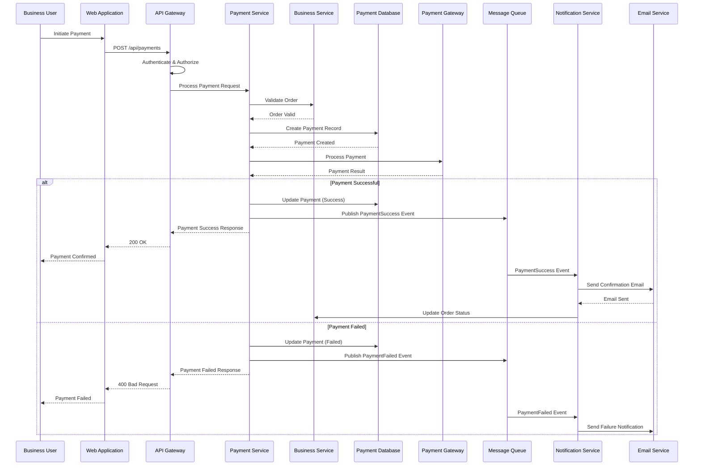
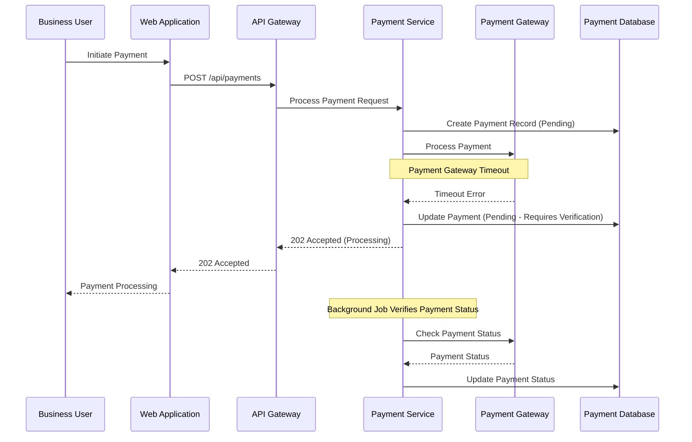

# Sequence Diagram – Payment Processing

## Purpose

This sequence diagram shows the flow of a payment processing request through the Icarus Platform, illustrating the interactions between users, services, and external systems over time.

This diagram helps understand:
- The order of operations
- Synchronous vs. asynchronous interactions
- Error handling flows
- External system dependencies

---

## Payment Processing Sequence

### Main Flow

---

## Alternative Flow: Payment Timeout

---

## Actors and Components

### Business User
- Initiates payment through web application
- Receives payment confirmation or failure notification

### Web Application
- User interface for payment initiation
- Displays payment status and results

### API Gateway
- Authenticates and authorizes requests
- Routes requests to appropriate services
- Handles rate limiting

### Payment Service
- Orchestrates payment processing
- Manages payment state
- Integrates with payment gateway
- Publishes payment events

### Business Service
- Validates order before payment
- Updates order status after payment

### Payment Database
- Stores payment records
- Tracks payment state
- Maintains payment history

### Payment Gateway (External)
- Processes actual payment transactions
- Returns payment results
- Handles payment verification

### Message Queue
- Enables asynchronous event processing
- Decouples services

### Notification Service
- Handles notification delivery
- Processes payment events

### Email Service (External)
- Sends email notifications
- Handles email delivery

---

## Key Interactions

### Synchronous Interactions
1. **User → Web App → API Gateway → Payment Service:** Payment request flow
2. **Payment Service → Business Service:** Order validation
3. **Payment Service → Payment Gateway:** Payment processing
4. **Payment Service → Payment Database:** Payment record management

### Asynchronous Interactions
1. **Payment Service → Message Queue:** Event publishing
2. **Message Queue → Notification Service:** Event consumption
3. **Notification Service → Email Service:** Email delivery
4. **Notification Service → Business Service:** Order status update

---

## Error Handling

### Payment Gateway Failure
- Payment marked as "pending verification"
- Background job retries verification
- User notified of processing status

### Order Validation Failure
- Payment rejected immediately
- User notified of validation error
- No payment record created

### Database Failure
- Transaction rolled back
- Error returned to user
- Payment gateway notified (if payment already processed)

### Network Timeout
- Payment marked as pending
- Background verification process
- User notified of processing status

---

## Timing Considerations

### Expected Response Times
- **Payment Processing:** 2-5 seconds (synchronous)
- **Email Notification:** Asynchronous (within 30 seconds)
- **Order Status Update:** Asynchronous (within 10 seconds)

### Timeout Values
- **Payment Gateway:** 30 seconds
- **Database Operations:** 5 seconds
- **Service-to-Service:** 10 seconds

---

## Security Considerations

### Authentication
- All requests authenticated via API Gateway
- Payment Service validates user authorization

### Data Protection
- Payment data encrypted in transit
- Payment data encrypted at rest
- PCI-DSS compliance for payment processing

### Audit Trail
- All payment operations logged
- Payment state changes tracked
- Events published for audit

---

## Related Documents

- **[Container Diagram](./c4-containers.md)** – System architecture
- **[Payment Service Components](./c4-components.md)** – Internal structure
- **[Architecture Decision Records](../adr/)** – Payment processing decisions

---

**Last Updated:** 2026-01-15  
**Maintained by:** Icarus Nova IT Architecture Team
